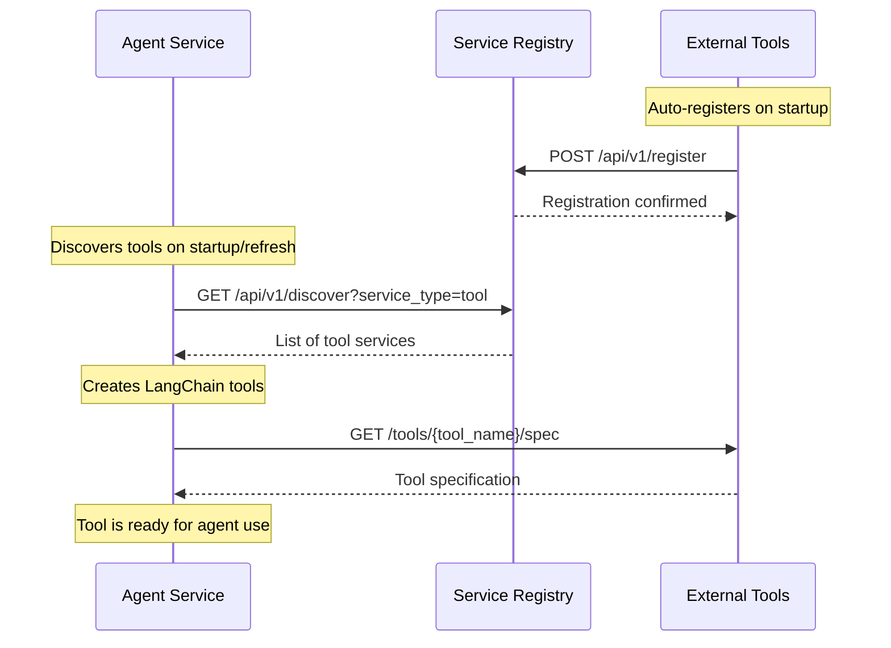
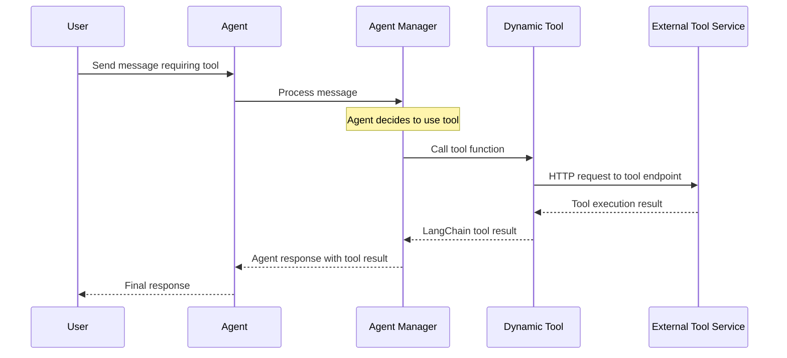

# Agent Tool System Documentation

## Overview

This system implements a distributed, microservices-based architecture for AI agents to dynamically discover and call external tools. The architecture enables serverless tool execution with dynamic service discovery through a centralized service registry.

## System Architecture

```
┌─────────────────┐    ┌─────────────────┐    ┌─────────────────┐
│   Agent Service │    │ Service Registry│    │ External Tools  │
│   (Port 3004)   │    │   (Port 3003)   │    │   (Port 3006)   │
│                 │    │                 │    │                 │
│ ┌─────────────┐ │    │ ┌─────────────┐ │    │ ┌─────────────┐ │
│ │Agent Manager│ │    │ │ Zookeeper   │ │    │ │ Calculator  │ │
│ │             │ │    │ │ Registry    │ │    │ │ Web Scraper │ │
│ │ ┌─────────┐ │ │    │ │             │ │    │ │ Search      │ │
│ │ │Dynamic  │ │ │    │ │ Service     │ │    │ │ Messages    │ │
│ │ │Tool     │ │ │◄──►│ │ Discovery   │ │◄──►│ │             │ │
│ │ │Loader   │ │ │    │ │             │ │    │ │ Auto-       │ │
│ │ └─────────┘ │ │    │ │ Health      │ │    │ │ Registration│ │
│ │             │ │    │ │ Monitoring  │ │    │ │             │ │
│ └─────────────┘ │    │ └─────────────┘ │    │ └─────────────┘ │
└─────────────────┘    └─────────────────┘    └─────────────────┘
```

## How Agent Calls Tools

### 1. Service Discovery Flow



### 2. Tool Execution Flow



### 3. Dynamic Tool Loading Process

The `AgentManager` loads tools dynamically through these steps:

1. **Service Discovery**: Query service registry for tool services
2. **Tool Specification**: Fetch tool schemas from each service
3. **LangChain Integration**: Convert HTTP tools to LangChain `Tool` objects
4. **Agent Creation**: Agents are created with all available tools

```python
# Key components in agent_manager.py
class AgentManager:
    async def _load_dynamic_tools(self):
        """Load dynamic tools from service registry."""
        self.dynamic_tools = await self.tool_loader.load_tools()
        
    async def refresh_tools(self):
        """Refresh tools and recreate agents."""
        self.dynamic_tools = await self.tool_loader.refresh_tools()
        # Recreate all agents with new tools
        old_agents = self.agents.copy()
        self.agents.clear()
        for session_id in old_agents.keys():
            self._create_agent(session_id)
```

## External Tool Service Structure

### Service Organization

```
back/ext-tool/
├── main.py                 # FastAPI app & service registration
├── config/
│   └── settings.py         # Configuration
├── services/
│   └── registration.py     # Service registry client
├── tools/                  # Tool implementations
│   ├── calculator/
│   │   ├── api.py         # FastAPI routes
│   │   ├── service.py     # Business logic
│   │   └── __init__.py
│   ├── web_scraper/
│   └── search_messages/
└── core/
    └── logging.py
```

### Tool Implementation Pattern

Each tool follows a consistent pattern:

1. **API Layer** (`api.py`): FastAPI routes and HTTP handling
2. **Service Layer** (`service.py`): Business logic and data models
3. **Integration**: Auto-discovery through service registry

## Adding New Tools to ext-tool Service

### Step 1: Create Tool Directory Structure

```bash
mkdir -p back/ext-tool/tools/my_new_tool
cd back/ext-tool/tools/my_new_tool
touch __init__.py api.py service.py
```

### Step 2: Implement Service Layer

Create `service.py` with your tool's business logic:

```python
# back/ext-tool/tools/my_new_tool/service.py
"""
My New Tool Service
Business logic for my custom tool
"""

from typing import Dict, Any, List, Optional
from pydantic import BaseModel
import asyncio

class MyToolRequest(BaseModel):
    """Request model for my tool"""
    input_data: str
    options: Optional[Dict[str, Any]] = {}

class MyToolResult(BaseModel):
    """Result model for my tool"""
    output: str
    success: bool = True
    error: Optional[str] = None
    metadata: Optional[Dict[str, Any]] = {}

class MyToolService:
    """Service class for my custom tool"""
    
    def __init__(self):
        self.name = "my-new-tool"
        self.description = "Description of what my tool does"
    
    async def process_data(self, request: MyToolRequest) -> MyToolResult:
        """Main processing method"""
        try:
            # Your tool logic here
            result = f"Processed: {request.input_data}"
            
            return MyToolResult(
                output=result,
                success=True,
                metadata={"processed_at": "timestamp"}
            )
        except Exception as e:
            return MyToolResult(
                output="",
                success=False,
                error=str(e)
            )
    
    def get_capabilities(self) -> Dict[str, Any]:
        """Return tool capabilities"""
        return {
            "name": self.name,
            "description": self.description,
            "operations": ["process"],
            "input_types": ["text"],
            "output_types": ["text"]
        }
```

### Step 3: Implement API Layer

Create `api.py` with FastAPI routes:

```python
# back/ext-tool/tools/my_new_tool/api.py
"""
My New Tool API
HTTP endpoints for my custom tool
"""

from fastapi import APIRouter, HTTPException
from core.logging import get_logger
from .service import MyToolService, MyToolRequest, MyToolResult

router = APIRouter()
logger = get_logger(__name__)

# Global service instance
tool_service = MyToolService()

@router.post("/process", response_model=MyToolResult)
async def process_data(request: MyToolRequest):
    """Process data with my tool"""
    try:
        result = await tool_service.process_data(request)
        return result
    except Exception as e:
        logger.error(f"❌ Tool error: {e}")
        return MyToolResult(
            output="",
            success=False,
            error=str(e)
        )

@router.get("/process")
async def process_simple(input_data: str):
    """Simple processing endpoint"""
    request = MyToolRequest(input_data=input_data)
    return await process_data(request)

@router.get("/capabilities")
async def get_capabilities():
    """Get tool capabilities"""
    return tool_service.get_capabilities()

@router.get("/health")
async def tool_health():
    """Health check for this tool"""
    capabilities = tool_service.get_capabilities()
    return {
        "status": "healthy",
        "tool": capabilities["name"],
        "operations": capabilities["operations"]
    }
```

### Step 4: Register Tool in Main App

Update `main.py` to include your new tool:

```python
# back/ext-tool/main.py (add to existing imports and routes)
from tools.my_new_tool.api import router as my_new_tool_router

# Add to the main app
app.include_router(
    my_new_tool_router,
    prefix="/tools/my-new-tool",
    tags=["my-new-tool"]
)
```

### Step 5: Update Tool Discovery

The tool will be automatically discovered by the agent through the service registry. The agent queries each tool service and creates LangChain tools based on the available endpoints.

### Step 6: Test Your Tool

1. **Start the services**:
   ```bash
   docker-compose build ext-tool
   docker-compose up ext-tool -d
   ```

2. **Test tool endpoint**:
   ```bash
   curl -X POST "http://localhost:3006/tools/my-new-tool/process" \
        -H "Content-Type: application/json" \
        -d '{"input_data": "test data"}'
   ```

3. **Refresh agent tools**:
   ```bash
   curl -X POST "http://localhost:3004/api/v1/tools/refresh"
   ```

4. **Verify tool is loaded**:
   ```bash
   curl "http://localhost:3004/api/v1/tools"
   ```

## Tool Specification Format

Tools are automatically converted to LangChain format. The agent creates tool specifications based on:

1. **Endpoint Discovery**: Scans FastAPI routes
2. **Schema Extraction**: Uses Pydantic models for parameters
3. **Documentation**: Uses docstrings and route descriptions

Example generated tool specification:
```python
Tool(
    name="my-new-tool",
    description="Description of what my tool does",
    func=lambda input_data: http_call_to_tool(input_data)
)
```

## Best Practices

### Tool Design
- **Single Responsibility**: Each tool should have a focused purpose
- **Async Support**: Use async/await for I/O operations
- **Error Handling**: Always return structured error responses
- **Type Safety**: Use Pydantic models for request/response

### API Design
- **RESTful Endpoints**: Follow REST conventions
- **Health Checks**: Implement `/health` endpoint
- **Capabilities**: Provide `/capabilities` endpoint
- **Documentation**: Use FastAPI auto-documentation

### Service Integration
- **Auto-Registration**: Tools register automatically on startup
- **Heartbeat**: Service registry monitors health
- **Graceful Shutdown**: Clean unregistration on shutdown

## Configuration

### Environment Variables
```bash
# Service Registry
SERVICE_REGISTRY_URL=http://service-registry:3003

# Tool Service
EXT_TOOL_PORT=3006
TOOL_SERVICE_NAME=ext-tool
```

### Docker Configuration
```yaml
# docker-compose.yml
ext-tool:
  build: ./back/ext-tool
  ports:
    - "3006:3006"
  environment:
    - SERVICE_REGISTRY_URL=http://service-registry:3003
  depends_on:
    - service-registry
```

## Troubleshooting

### Common Issues

1. **Tool not discovered**: Check service registration and network connectivity
2. **Tool execution fails**: Verify endpoint availability and request format
3. **Agent doesn't use tool**: Check tool description and LLM model capabilities

### Debugging Commands

```bash
# Check service registry
curl http://localhost:3003/api/v1/discover

# Check tool health
curl http://localhost:3006/health

# Check agent tools
curl http://localhost:3004/api/v1/tools

# View logs
docker-compose logs ext-tool
docker-compose logs agent
docker-compose logs service-registry
```

## Advanced Features

### Custom Tool Behaviors
- **Streaming**: Implement streaming responses for long operations
- **Authentication**: Add authentication for sensitive tools
- **Rate Limiting**: Implement rate limiting for resource-intensive tools
- **Caching**: Cache frequently requested results

### Tool Composition
- **Pipeline Tools**: Chain multiple tools together
- **Conditional Logic**: Tools that make decisions
- **Parallel Execution**: Execute multiple tools concurrently

### Monitoring
- **Metrics**: Track tool usage and performance
- **Logging**: Comprehensive logging for debugging
- **Alerting**: Alert on tool failures or performance issues

This architecture provides a flexible, scalable foundation for building AI agents with dynamic tool capabilities.
